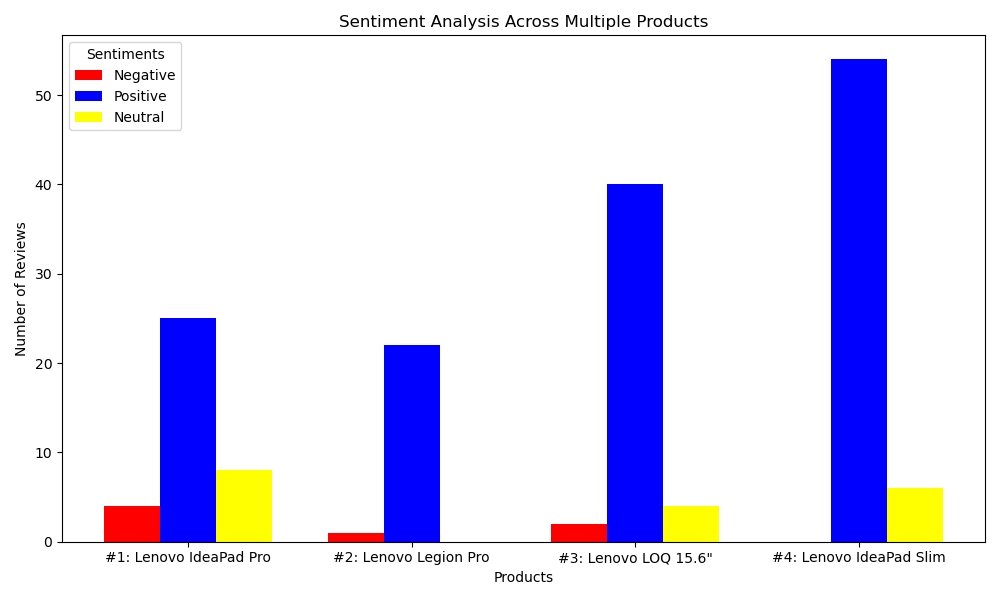

## What this program does:
This program takes a single text file with ebay product urls as input. These urls are scraped for all of the reviews for that product. A reivew_product text file is created for each given product. Phi3 then gives a one word sentiment (positive, negative, or neutral) for each review in each of the files. These sentiments are stored in text files (again one file for each given product url). The program then creates a single graph comparing the counts of positive, negative, and neutral between each product.

## Libraries used:
- ollama (interact with SLM phi3)
- os (navigate file explorer)
- requests (abstract html)
- selenium (abstract html when dynamic or when website thinks program is a bot)
- BeautifulSoup4 (scrape websites)
- matplotlib (create graph)

## How to use:
1. have Conda installed and working
2. download the `requirements.yaml` file
3. run command `conda env create -f requirements.yaml` to create a conda evironment with the needed requirements
4. download `urls.txt`, `program.py`, `modules.py`, and `config.py` files  
‼️ **Note:** update `reviews_folder_path` and `sentiments_folder_path` variables in the `config.py` file
5. have Ollama phi3 running (use `ollama run phi3` followed by `/bye` in terminal)
6. run `program.py` inside the environment
7. `reviews_product<#>.txt` files will be created (one for each of the urls/products)
8. `sentiments_product<#>.txt` files will be created from each of the `reviews_product<#>.txt` files
9. an overall graph will be created to compare all of the `sentiments_product<#>.txt` files